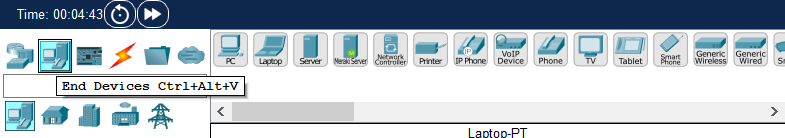
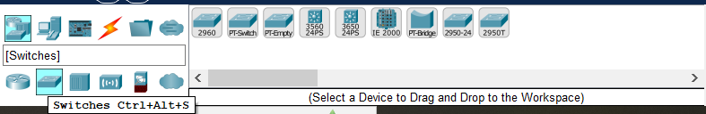
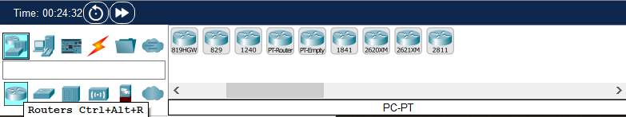
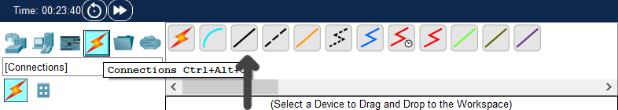
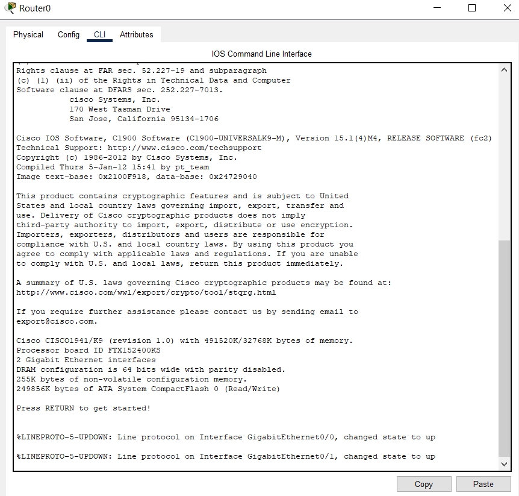
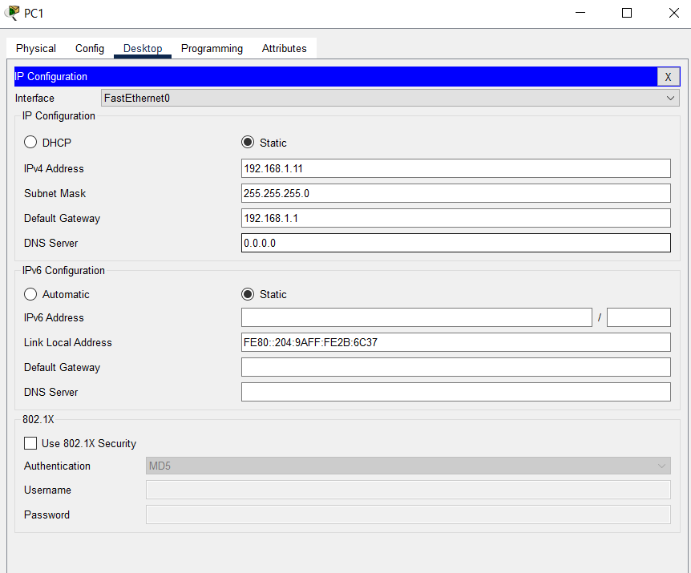
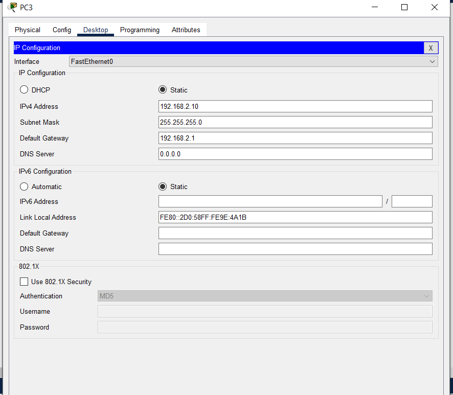
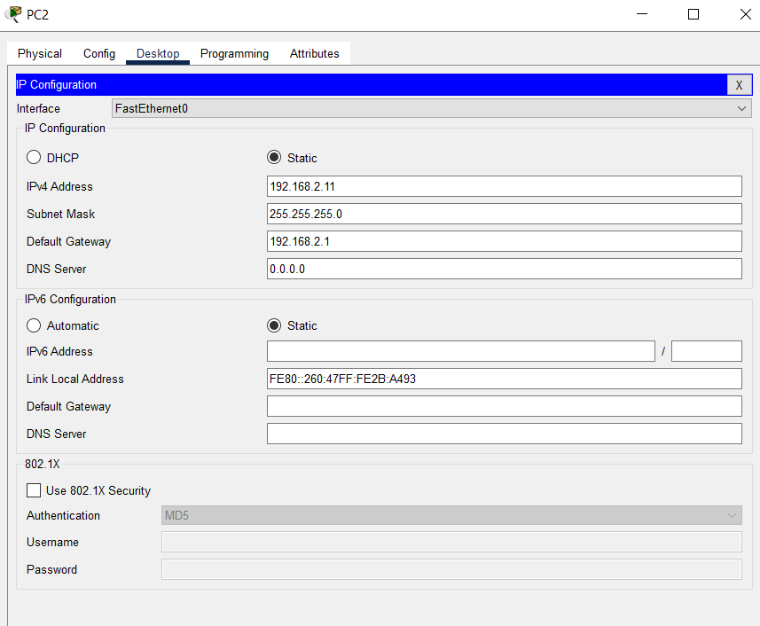
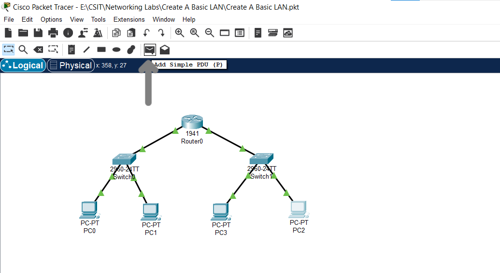

# LAB 01 - Basic Inter - LAN Routing

## Overview

In this lab we will create a basic LAN using:

- A Router
- 2 Switches
- 4 PCs
- Copper Straight Wires for connectivity

## Setup

### LAN 1 - Setup

- First we select two PCs. For this we navigate to the bottom panel in the left most corner to select first **End Devices**, then select **PC**

    

- Then we have to select a switch. For this we have to select from the options panel below the end devices option.

    

    From here we select the first switch on the right side **`2960`**

- Now we select a router which can be found beside the switrch option

    

    Select router numbered **`1941`**

- To connect all these together we will utilize **Copper straight through wires** 

    

- #### Connections

    In order to connect them we will follow the following order:

    | From Device | From Port         | To Device | To Port           |
    |-------------|-------------------|-----------|-------------------|
    | PC0         | FastEthernet0     | Switch1   | FastEthernet0/1   |
    | PC1         | FastEthernet0     | Switch1   | FastEthernet0/2   |
    | Switch1     | GigabitEthernet0/1| Router    | GigabitEthernet0/0|

### LAN 2 - Setup

Repeat the same steps as above from LAN 1 - setup to select 2 PCs, a switch(2960) and a router(1941)

- #### Connections

    In order to connect them we will follow the following order:

    | From Device | From Port         | To Device | To Port           |
    |-------------|-------------------|-----------|-------------------|
    | PC2         | FastEthernet0     | Switch2   | FastEthernet0/1   |
    | PC3         | FastEthernet0     | Switch2   | FastEthernet0/2   |
    | Switch2     | GigabitEthernet0/0| Router    | GigabitEthernet0/1|

The setup will look like this

## Configuration

- First we start by configuring the router. Click on router and select the CLI tab.

    

    Then we enter the following commands step by step

    This is where we will enter the following commands step by step.

    - `Router> enable`

    The above command will allow access to configuration commands

    - `Router# configure terminal`

    Using this we enter global configuration mode to allow making changes to the device.

    - `Router(config)# interface gig0/0`

    Accesses the configuration mode for the GigabitEthernet0/0 interface.

    - `Router(config-if)# ip address 192.168.1.1 255.255.255.0`

    Assigns an IP address and subnet mask to the selected interface.Here I chose this one you can select any private ip address.

    - `Router(config-if)# no shutdown`

    Enables (brings up) the interface, which is administratively down by default.

    - `Router(config-if)# exit`

    Exits the interface configuration mode and returns to global config mode.

    Now we will repeat the same commands for the other interface just make sure to change the network ip address and interface name

    - `Router(config)# interface gig0/1`

    - `Router(config-if)# ip address 192.168.2.1 255.255.255.0`

    - `Router(config-if)# no shutdown`

    - `Router(config-if)# exit`

    - `Router(config)# wr`

    The above command used at the end saves our router configurations so that if we open this file in the future we won't have to reconfigure.

- Now in order to configure the PCs click on **PCO**. Select desktop then IP Configuration and enter the values in the fields as in the picture

    

- Do the same with PC1 

    

- Repeat the process for PC2 and PC3

    

    

## Testing

Now after all the wire arrows turn green, from the top panel choose the envelope option and drag and drop it on the starting PC and the intended destination (PC, Router). If the logs in the bottom right panel show **Successfull** then your network is setup correctly

